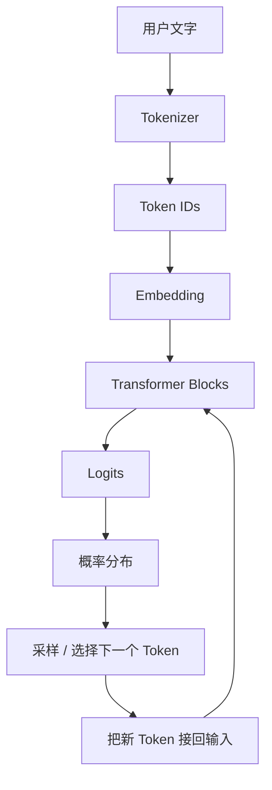
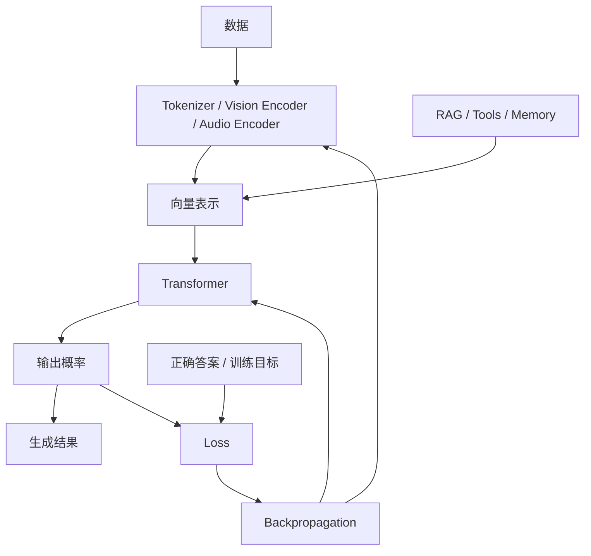

# 00 · 先建立一张脑内地图

如果只记一句话：

> **LLM 是一台把输入变成向量、让向量彼此影响、然后不断预测下一个 Token 的机器。**

这句话很粗糙，但足够作为第一张地图。

## 先不要把 LLM 想成“会说话的大脑”

从工程角度看，一次最普通的文本生成可以粗略写成：



你输入的并不是直接交给 Transformer 的汉字。文字首先会被切分成 Token，再映射成高维向量。Transformer 真正处理的是这些向量。

## 五个核心零件

### 1. Tokenizer：把输入切成离散单位

例如一句话可能被切成：

```text
我 | 喜欢 | 大 | 语言 | 模型
```

真实 tokenizer 的切分未必符合人的词语边界，但核心作用一样：把任意字符串变成有限词表中的编号。

### 2. Embedding：把编号变成向量

Token ID 本身只是编号，例如：

```text
1257
```

它没有“意义”。Embedding 会把它查表成一个高维向量：

```text
[0.12, -0.83, 0.41, ...]
```

从这一步开始，模型可以通过向量之间的关系表达某些统计和语义结构。

### 3. Transformer：让信息彼此作用

Transformer Block 通常包含 Attention、前馈网络、归一化和残差连接等组件。

这里先记住一件事：

> 一个 Token 的表示并不是固定的，它会随着上下文不断改变。

“苹果”出现在“苹果手机”和“吃苹果”里，进入深层 Transformer 后会形成不同的上下文表示。

### 4. 输出头：把内部状态变成词表概率

模型最后会得到一个针对整个词表的分数：

```text
今天       1.2
苹果      -0.8
天气       4.9
很好       3.7
Transformer 0.3
...
```

经过 Softmax 后变成概率分布，再选择下一个 Token。

### 5. 训练：决定这些矩阵最后长成什么样

模型刚初始化时，绝大多数参数没有你期待的能力。训练通过大量样本不断计算预测误差，再用反向传播调整权重。

所以推理阶段很多看似“聪明”的行为，并不是现场临时学会的，而是训练过程把某种映射关系写进了参数。

## 一张更完整的地图



这张图以后会反复出现。

## 为什么先画地图？

因为很多术语只是这条信息流里的不同位置。

- Token：输入离散化
- Embedding：输入向量化
- Attention：表示之间如何交换信息
- Loss：输出错了多少
- Gradient：参数应该往哪个方向改
- RAG：把外部信息插入当前上下文
- Multimodal：让其他模态也形成可参与计算的表示
- Agent：让模型输出不仅是文字，还可以驱动工具和下一步状态

当你知道一个新概念位于这条链的什么位置，理解难度会骤降。

## 本章结论

先暂时把 LLM 记成：

```text
输入
 ↓
离散化 / 编码
 ↓
高维表示
 ↓
Transformer 反复混合上下文
 ↓
下一个 Token 的概率
 ↓
循环生成
```

接下来我们从最开始的 Token 和 Embedding 拆起。
