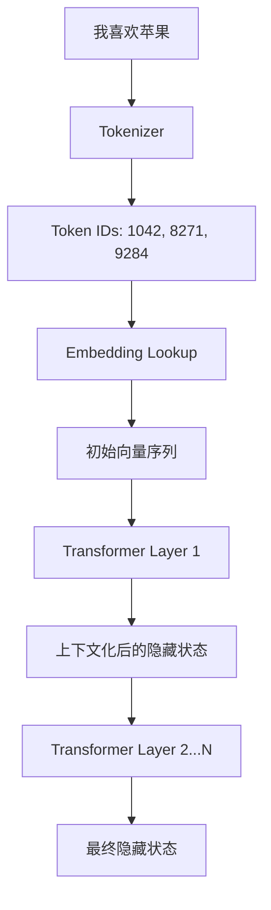

# 01 · Token 与 Embedding：模型真正看到的是什么

> 一句话直觉：**LLM 不直接处理文字，它处理的是一串向量。Token 是“切成什么单位”，Embedding 是“把这个单位放到哪里”。**

很多人第一次接触 LLM，会把 Token 理解成“一个字”，把 Embedding 理解成“给每个字编号”。这两个理解都只对了一小部分。

---

## 1. 从一句话开始

假设输入是：

```text
我喜欢吃苹果
```

模型不能直接拿汉字做矩阵乘法，所以第一步一定要把它变成离散单位：

```text
文字
 ↓ Tokenizer
[我] [喜欢] [吃] [苹果]
```

但真实 Tokenizer 不一定按词切。它可能得到：

```text
[我] [喜欢] [吃] [苹] [果]
```

也可能对英文拆成：

```text
unbelievable
→ [un] [believ] [able]
```

因此更准确的定义是：

**Token 是词表中的一个离散符号单元。**

它可以是一个字、一个词、半个词、标点，甚至一段常见字符串。

---

## 2. Token ID 还不是模型真正“理解”的东西

Tokenizer 会给每个 Token 一个整数 ID：

```text
[我]   → 1042
[喜欢] → 8271
[吃]   → 319
[苹果] → 9284
```

但这些数字没有大小意义。

```text
9284 > 319
```

不代表“苹果”比“吃”更大、更重要或更接近某种概念。

它们更像图书馆的书号：只负责找到对应条目。


---

## 3. Embedding：从“编号”进入连续空间

模型里会有一张巨大的 Embedding 表。

假设隐藏维度只有 4 维：

```text
Token 1042「我」
→ [ 0.21, -0.44,  0.72,  0.05 ]

Token 8271「喜欢」
→ [-0.13,  0.81,  0.22, -0.36 ]
```

真实模型通常不是 4 维，而可能是几千维。

从这里开始，Transformer 不再看到“我”“喜欢”这些字符，它看到的是：

```text
向量1
向量2
向量3
向量4
...
```

所以从数学角度看，LLM 更准确的描述是：

> **一个处理高维向量序列，并持续重写这些向量表示的模型。**

---

## 4. 为什么需要 Embedding，而不是直接用 Token ID？

假设直接用 ID：

```text
猫 = 101
狗 = 203
汽车 = 204
```

从数字距离看：

```text
狗 和 汽车只差 1
猫 和 狗差 102
```

这完全不代表语义关系。

Embedding 把每个 Token 变成很多维度后，模型可以学习某些方向表示某些潜在关系：

```text
猫 ─┐
    ├─ 动物相关区域
狗 ─┘

汽车 ─ 交通工具相关区域
```

这里不要把它误解成“第 17 维就是动物”。真实模型里的概念通常是**分布式表示**：一个概念由许多维度、许多层、许多神经元共同编码。

---

## 5. 一个 Token 的表示不是固定不变的

这是理解 Transformer 的关键。

初始 Embedding 只是起点。

例如“苹果”出现在：

```text
我吃了一个苹果。
```

和：

```text
苹果发布了新电脑。
```

刚进入模型时，如果它们使用同一个 Token，那么初始 Embedding 可以相同。

但经过 Transformer 层之后：

```text
初始「苹果」向量
       ↓
Self-Attention 读取上下文
       ↓
新的隐藏状态
```

第一个“苹果”会受到“吃、一个”等词影响；第二个会受到“发布、电脑”等词影响。

所以真正承载上下文语义的不是最开始的 Token Embedding，而是模型逐层计算后的 **hidden state（隐藏状态）**。

---

## 6. 不要把 Embedding 想成“翻译成意思”

一个很常见的错误模型是：

```text
苹果
 ↓
翻译成：一种红色水果
 ↓
给 Transformer
```

不是这样。

Embedding 更接近：

```text
苹果
 ↓
一个可训练的高维坐标
 ↓
与上下文不断发生数学交互
```

它并不需要先生成一句人类可读的定义。

这和后面我们讲多模态时非常重要：图片也可以被变成向量，而不必先变成文字描述。

---

## 7. Token 数为什么影响成本与上下文？

Transformer 处理的是 Token 序列，所以：

```text
1000 个汉字
```

并不严格等于：

```text
1000 Tokens
```

不同 Tokenizer、不同语言、不同字符串会有不同切分方式。

上下文窗口说的 32K、128K、1M，一般都是 Token 数量，不是字数。

而传统全量 Self-Attention 中，序列越长，Token 两两交互的计算规模增长很快，所以长上下文一直是模型工程的重要问题。

---

## 8. 把这一章压缩成一张图



记住三个层次：

| 层次 | 它是什么 |
| --- | --- |
| Token | 离散的信息单位 |
| Token ID | 查词表用的整数编号 |
| Embedding / Hidden State | 真正参加神经网络计算的向量 |

---

## 9. 一个容易被忽略的问题

如果模型内部最终都是数字，那它到底在哪里“理解”了文字？

答案是：**没有某个单独步骤叫“理解”。**

“理解”更像是许多层计算之后，一组隐藏状态对输入结构形成了足够有用的内部表示。

这会直接引出下一章：

> 如果模型只是拿到一串向量，它又为什么能知道下一个 Token 应该是什么？

下一章我们只研究一件事：**Next Token Prediction。**
