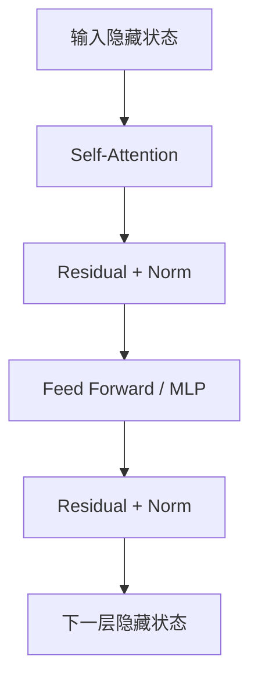
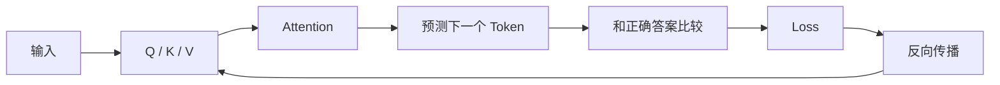
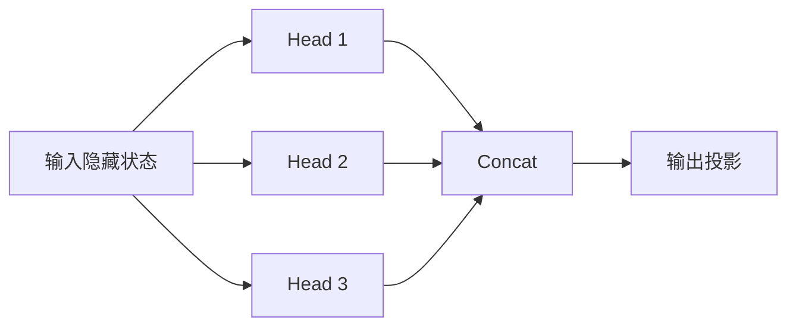

# 03 · Transformer 与 Attention：信息到底怎么流动

> 一句话直觉：**Transformer 不是“先理解再找重点”，而是让每个位置不断读取其他位置、改写自己，理解就是这种多层改写逐渐形成的结果。**

这一章先解决一个很容易让人觉得“逻辑循环”的问题：

> **模型如果还不知道哪个位置重要，凭什么先 Attention 到那里？如果它已经知道那里重要，那 Attention 不是多此一举吗？**

答案是：**Attention 不需要预先知道“那里是什么”，它只需要计算当前表示之间的相关性。**

---

## 1. Transformer 真正处理的是什么？

上一章结束时，我们得到了一串向量：

```text
Token 1 → x1
Token 2 → x2
Token 3 → x3
...
```

问题是：每个向量刚开始主要只代表“自己”。

例如：

```text
苹果 发布 了 新 电脑
```

刚进入模型时，“苹果”的向量并不会自动知道这里更可能指公司而不是水果。

Transformer 要做的事情可以粗略理解成：

```text
每个位置先看看其他位置
        ↓
取回对自己有用的信息
        ↓
更新自己的隐藏状态
        ↓
再进入下一层继续更新
```

于是“苹果”逐渐吸收“发布、电脑”等上下文，形成更适合当前句子的表示。

---

## 2. 一个 Transformer Block 可以先看成两台机器

极度简化后：



先记住分工：

- **Attention**：不同 Token 之间交换信息；
- **MLP / FFN**：每个 Token 在拿到上下文后，进一步变换自己的表示。

这两个过程叠很多层，才形成我们最后看到的复杂能力。

---

## 3. 为什么要有 Q、K、V？

对同一个输入向量 `x`，模型会通过三组可学习矩阵生成：

```text
Q = xWq
K = xWk
V = xWv
```

可以用一个不严格但非常好用的直觉：

- **Query**：我现在想找什么样的信息？
- **Key**：我这里有什么样的信息可供匹配？
- **Value**：如果你关注我，我实际贡献什么内容？

为什么不直接让原始向量互相点积？

因为“用什么条件去匹配”和“匹配成功后要读取什么”不是同一件事。

例如一句话：

```text
小明把书放到桌子上，因为它太重了。
```

模型处理“它”时，需要建立某种指代关系。用于判断“谁可能被指代”的特征可以放进 Key；真正取回的对象语义可以通过 Value 提供。

Q/K/V 就给了模型三个可以分别学习的空间。

---

## 4. Attention 不是搜索，而是一次性给所有位置打分

假设当前 Query 是 `Q`，序列中有：

```text
K1, K2, K3, ... Kn
```

模型直接计算：

```text
Q · K1
Q · K2
Q · K3
...
Q · Kn
```

正式一点，常见写法是：

```text
Attention(Q, K, V) = softmax(QK^T / sqrt(d_k)) V
```

分成三步：

1. `QK^T`：计算所有匹配分数；
2. `softmax`：把分数转成总和为 1 的权重；
3. 乘 `V`：按权重混合真正的信息。

所以它并不是：

```text
先猜一个位置
 ↓
过去看一下
 ↓
不对再找下一个
```

而更像：

```text
所有位置同时打分
 ↓
相关位置权重大
 ↓
不相关位置权重小
```

---

## 5. “没理解怎么先找到重点”的循环矛盾在哪里消失？

如果 Attention 真的是：

```text
先理解
 ↓
给位置打标签
 ↓
再找标签
```

确实会出现死循环。

但真实过程是：

```text
当前隐藏状态
 ↓
矩阵投影得到 Q / K / V
 ↓
计算数值相关性
 ↓
加权组合
 ↓
得到新的隐藏状态
```

这里没有任何地方要求：

```python
if token.meaning == "裂纹":
    attend(token)
```

“裂纹”“主语”“公司”“因果关系”这些结构不一定以显式标签存在。它们更多表现为高维表示之间稳定的几何与函数关系。

---

## 6. 那为什么正确位置的分数会高？

这才是关键。

**因为训练把产生 Q、K、V 的参数调成了这样。**

随机初始化时，Attention 基本没有意义。模型会关注错地方，也会预测错 Token。



大量训练之后，能够帮助预测正确答案的匹配方式被保留下来。

所以推理阶段并不是：

```text
先知道答案 → 再找到相关位置
```

而是：

```text
训练阶段学会“什么表示通常应该互相读取”
                      ↓
推理阶段直接执行已经学好的函数
```

---

## 7. 为什么还要除以 sqrt(d_k)？

如果向量维度很高，点积的数值幅度容易变大。

数值太大进入 Softmax 后，可能迅速变得极端：

```text
[0.01, 0.02, 0.03, 15.0]
            ↓ softmax
[接近0, 接近0, 接近0, 接近1]
```

这会让训练更不稳定。

所以 Scaled Dot-Product Attention 会用：

```text
QK^T / sqrt(d_k)
```

把分数尺度控制在更合适的范围。

---

## 8. 为什么需要 Multi-Head Attention？

如果只有一套 Q/K/V，所有关系都要挤在同一个匹配空间里。

Multi-Head Attention 会并行学习多组投影：

```text
Head 1: Q1 K1 V1
Head 2: Q2 K2 V2
Head 3: Q3 K3 V3
...
```

你可以把它理解成：

> **同一句话允许同时从多种“关系视角”读取信息。**

某些 Head 可能更容易表达局部邻近关系，某些更容易捕捉远距离指代或结构关系。但不要把它机械理解成“Head 1 永远负责语法、Head 2 永远负责人物”，真实网络往往更分布式、更复杂。

流程大致是：



---

## 9. 为什么还需要 MLP？Attention 不够吗？

Attention 擅长的是：

```text
从别的位置取信息
```

但取回来之后，还需要对当前表示做更复杂的非线性变换。

所以一个 Block 通常还会有 FFN / MLP，例如：

```text
x
 ↓ Linear
更高维
 ↓ 激活函数
非线性变换
 ↓ Linear
回到隐藏维度
```

可以粗略理解成：

```text
Attention = 通信
MLP       = 每个位置自己的内部计算
```

两者缺一不可。

---

## 10. Residual Connection 为什么重要？

如果每层都完全重写输入，深层网络很难训练。

Residual Connection 做的是：

```text
output = x + f(x)
```

也就是：

> 不要求这一层重新发明整个表示，只需要在原表示上写一个“修改量”。

直觉上类似：

```text
原来的理解
   +
这一层新获得的信息
   =
更新后的理解
```

它让几十层、上百层网络的优化变得可行得多。

---

## 11. Causal Mask：为什么模型不能偷看未来？

训练生成式 LLM 时，一句话可以一次送进 GPU：

```text
我 今天 去 学校
```

但预测“今天”时，模型不能提前看到“去 学校”。

因此 Attention 会加一个因果遮罩：

```text
        我  今天  去  学校
我      ✓   ×    ×   ×
今天    ✓   ✓    ×   ×
去      ✓   ✓    ✓   ×
学校    ✓   ✓    ✓   ✓
```

每个位置只能看自己和左边已经出现的 Token。

这就是 Decoder-only LLM 中非常关键的 **Causal Self-Attention**。

---

## 12. 多层之后，“理解”到底出现在哪里？

不要寻找某一行代码：

```text
understand(sentence)
```

它不存在。

更接近真实情况的是：

```text
初始 Embedding
 ↓
Attention：加入一些上下文
 ↓
MLP：变换表示
 ↓
Attention：建立更复杂关系
 ↓
MLP：继续变换
 ↓
...
 ↓
最后的隐藏状态足以支持正确预测
```

所以：

> **“理解”不是 Transformer 之前的前置条件，而是多层 Attention + MLP 持续重写隐藏状态后表现出来的能力。**

---

## 13. 用一个最小矩阵把过程串起来

假设只有 3 个 Token，每个 Token 是 2 维：

```text
X = [
  [1.0, 0.0],
  [0.8, 0.2],
  [0.0, 1.0]
]
```

通过可学习矩阵：

```text
Q = XWq
K = XWk
V = XWv
```

然后：

```text
scores  = QK^T / sqrt(d)
weights = softmax(scores)
output  = weights V
```

这几行矩阵运算，就是 Attention 最核心的骨架。

仓库中的：

```bash
python codes/attention_demo.py
```

会把每一步数值都打印出来。

---

## 14. 这一章只需要带走六件事

1. **Transformer 处理的是隐藏向量，不是直接处理文字。**
2. **Attention 的作用是让不同位置动态交换信息。**
3. **Q/K/V 是三种可学习投影，不是人工标签。**
4. **Attention 不需要先“知道重点”；它对所有位置计算匹配。**
5. **相关性为什么有意义，是训练塑造出来的。**
6. **“理解”是多层表示更新的结果，不是 Attention 的前置条件。**

下一章我们会把最后一个黑盒拆掉：

> **这些一开始随机的 Wq、Wk、Wv 和其他参数，到底是怎么被 Loss 一点点改成现在这样的？**
