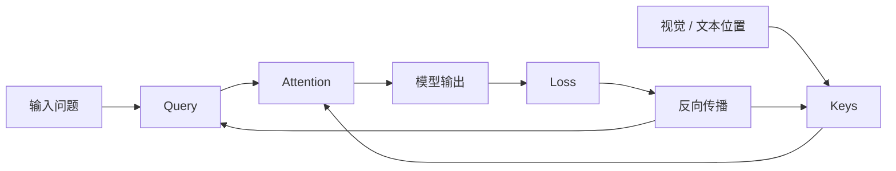

# 03 · Transformer 与 Attention

这一章先解决一个非常容易让人觉得“逻辑循环”的问题：

> **模型如果还不知道哪个区域重要，凭什么先 Attention 到那里？如果它已经知道那里重要，那 Attention 不是多此一举吗？**

答案是：**Attention 不需要预先知道“那里是什么”，它只需要能计算当前表示之间的相关性。**

## 先看错误直觉

很多人会把 Attention 想成：

```text
先理解整张图 / 整句话
      ↓
标出重点
      ↓
再去读取重点
```

如果真是这样，确实存在循环依赖：

```text
想理解 → 需要先找到重点
想找到重点 → 又需要先理解
```

但真实计算过程并不是这样。

## Attention 更像“一次性给所有位置打分”

假设当前问题里出现“裂纹”这个概念，模型会产生一个 Query 向量 `Q`。

同时，图片或文本序列里的每个位置都有自己的 Key：

```text
K1, K2, K3, ... K382, K383, ...
```

模型直接计算：

```text
Q · K1
Q · K2
Q · K3
...
Q · K382
Q · K383
...
```

也就是：**所有位置同时参与相关性计算。**

它不是先猜一个位置，再过去“看一眼”。

## 一个极简例子

假设三个位置的 Key 是：

```text
K1 = [1.0, 0.0]
K2 = [0.8, 0.2]
K3 = [0.0, 1.0]
```

当前 Query 是：

```text
Q = [1.0, 0.1]
```

点积得到：

```text
Q·K1 = 1.00
Q·K2 = 0.82
Q·K3 = 0.10
```

再经过 Softmax，就能形成 Attention 权重。

这里没有任何一行代码写着：

```text
if K1 means "裂纹":
    choose K1
```

模型只是在执行矩阵运算。

## 那为什么“正确区域”的点积会比较大？

这才是关键。

**因为训练把参数慢慢调成了这样。**

一开始随机初始化时，Query 和 Key 的关系基本是乱的。模型可能关注错误位置，并给出错误答案。



如果模型回答错了，Loss 会通过反向传播改变产生 Query、Key、Value 的参数，以及更前面的表示网络。

经过大量样本以后，某些语言模式和某些视觉 / 文本模式会在这个可学习空间里形成稳定的匹配关系。

所以推理阶段不是：

```text
先知道答案
↓
再找到区域
```

而是：

```text
训练阶段学会“什么样的表示通常彼此相关”
↓
推理阶段直接算相关性
↓
相关权重自然出现
```

## “理解”和“寻找”不是两个独立步骤

另一个容易误解的地方是，我们总想给神经网络安排人的工作流程：

```text
识别 → 理解 → 查找 → 判断
```

但深度网络通常更像连续的表示变换：

```text
初级特征
 ↓
Attention / MLP
 ↓
带更多上下文的特征
 ↓
Attention / MLP
 ↓
更高级的结构
 ↓
Attention / MLP
 ↓
可用于输出的语义状态
```

因此，**Attention 本身就是形成理解的一部分。**

模型并不需要在 Attention 之前先拥有一份完整的“世界解释”。

## Q、K、V 分别是在干什么？

可以先用一个不严格但好用的直觉：

- **Query**：我现在需要什么信息？
- **Key**：我这里大概有什么类型的信息？
- **Value**：如果你关注我，我真正提供什么内容？

注意，Key 不是人工标签，而是神经网络学出来的向量。

正式一点，常见 Attention 写作：

```text
Attention(Q, K, V) = softmax(QK^T / sqrt(d)) V
```

其中：

1. `QK^T` 计算所有 Query 与 Key 的匹配分数；
2. `softmax` 把分数变成权重；
3. 用权重对 Value 做加权求和。

## 为什么需要多层 Attention？

因为第一层拿到的只是相对低级的表示。

以视觉为例：

```text
像素 / Patch
   ↓
边缘、颜色、纹理
   ↓
局部结构
   ↓
物体组成部分
   ↓
对象与关系
   ↓
更抽象语义
```

某个 Patch 一开始并不会显式写着“裂纹”。随着网络加深，它的表示会吸收周围区域和任务上下文，最终成为一个能够参与“裂纹 / 破损 / 表面异常”等概念判断的高维状态。

## 最重要的结论

如果把这一章压成三句话：

1. **Attention 不是先定位再读取，而是同时计算所有位置的相关性。**
2. **相关性为什么有意义，是训练通过反向传播学出来的。**
3. **“找到”和“理解”并非前后两个独立步骤，而是在多层表示更新中共同形成。**

下一章会进一步解释：训练究竟如何把这些关系写进参数里。
