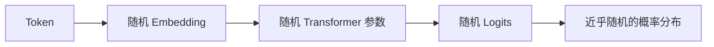
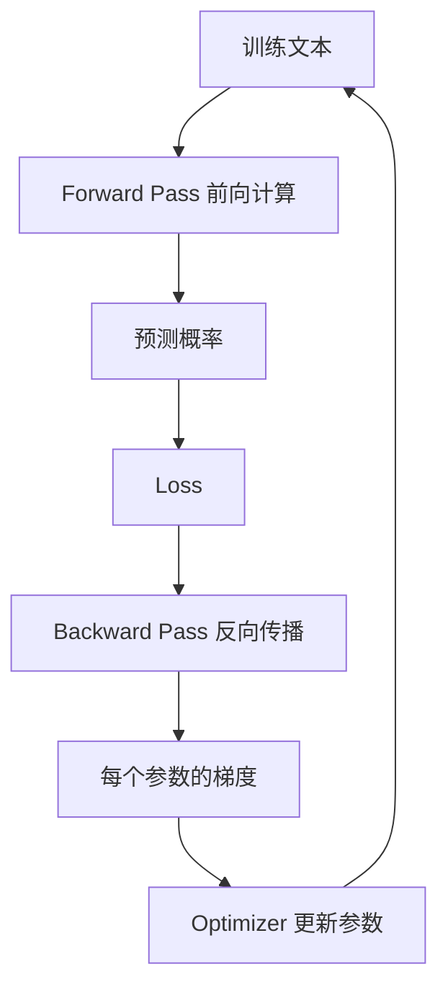
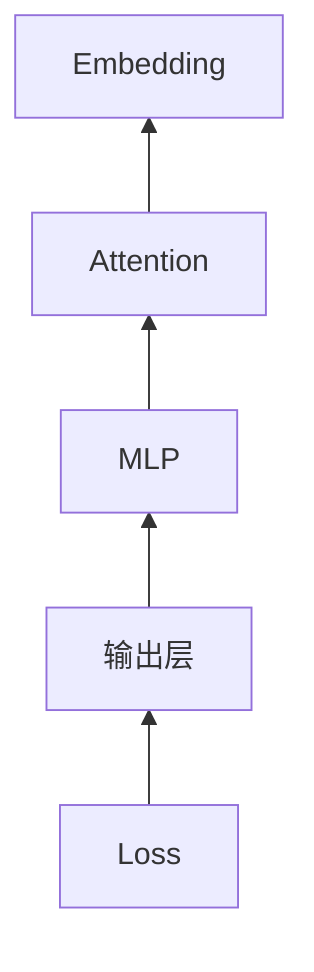
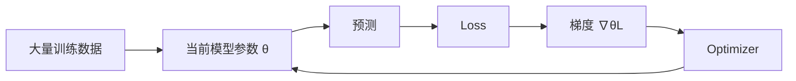

# 04 · Training：随机参数为什么最后会“懂”东西

> 一句话直觉：**训练不是把答案一条条存进模型，而是反复比较“模型现在的输出”和“正确答案”，再用梯度把数十亿个参数往更少犯错的方向推一点点。**

上一章我们说，Attention 里的 `Wq`、`Wk`、`Wv` 都是可学习参数。

真正的问题于是变成：

> 一堆最开始接近随机的数字，为什么最后会变成一个能够写作、编程、推理、识图的模型？

这一章只拆这件事。

---

## 1. 刚初始化的模型其实什么都不会

假设我们有一个刚创建的语言模型：

```text
输入：法国的首都是
```

它可能给出：

```text
香蕉  12%
雨伞   9%
巴黎   0.01%
...
```

这不是模型“笨”，而是因为此时参数几乎还没有承载有用结构。

它只是一个巨大的随机函数。



训练的目标，就是不断改变这个函数。

---

## 2. 一条训练样本到底长什么样？

对于自回归语言模型，一句话：

```text
我 喜欢 吃 苹果
```

实际上可以同时产生很多个训练目标：

```text
输入：我
目标：喜欢

输入：我 喜欢
目标：吃

输入：我 喜欢 吃
目标：苹果
```

工程上不会真的拆成三次独立运行；利用 causal mask，一整个序列可以并行计算多个位置的训练损失。

核心任务始终没变：

> **根据左侧上下文，让正确的下一个 Token 获得更高概率。**

---

## 3. Logits、Softmax 和概率

Transformer 最后一层会给词表中的每个 Token 一个分数，叫 **logit**。

例如：

```text
上下文：天空是

蓝色   logit = 5.2
红色   logit = 1.1
桌子   logit = -0.8
```

Logit 本身还不是概率。

经过 Softmax：

```text
蓝色   97%
红色    2%
桌子   <1%
```

训练时真正关心的是：

> 正确 Token 的概率够不够高？

---

## 4. Loss：把“错得有多离谱”变成一个数

语言模型最常见的核心目标之一是交叉熵损失。

如果正确答案是“蓝色”：

```text
模型 A：蓝色 0.90
模型 B：蓝色 0.10
模型 C：蓝色 0.001
```

显然 A 更好，C 错得最严重。

对单个正确 Token，可以先用这个形式理解：

```text
Loss = -log(P(correct_token))
```

于是：

```text
正确答案概率越接近 1
→ Loss 越小

正确答案概率越接近 0
→ Loss 越大
```

注意：Loss 并不会用中文告诉模型：

```text
“你把法国首都答错了，应该记住巴黎。”
```

它只给出一个数学目标：

> **怎样改参数，能让 Loss 下降？**

---

## 5. 梯度到底是什么？

先只想象模型只有一个参数 `w`。

```text
Loss = f(w)
```

现在：

```text
w = 2.0
Loss = 8.5
```

我们想知道：

```text
w 稍微增加一点，Loss 会增加还是减少？
```

这个“局部变化方向”就是导数 / 梯度的核心直觉。

如果：

```text
dLoss/dw > 0
```

意味着 `w` 往大走，Loss 会变大，那么优化器就应该让 `w` 往小走。

典型梯度下降写成：

```text
w_new = w_old - learning_rate × gradient
```

其中 learning rate 控制“一步走多远”。

---

## 6. 真实模型不是一个参数，而是几十亿个方向

真实模型可以粗略写成：

```text
Loss = f(w1, w2, w3, ... , wn)
```

反向传播要算的是：

```text
∂Loss/∂w1
∂Loss/∂w2
∂Loss/∂w3
...
∂Loss/∂wn
```

也就是：

> 每个参数如果稍微变化，会怎样影响最终 Loss？

然后优化器一起更新这些参数。



一次更新通常非常小。

真正的能力来自：

```text
极小的参数更新
×
海量 Token
×
海量训练步骤
```

---

## 7. 反向传播为什么能知道前面哪层“有责任”？

因为神经网络本质上是一条可微分的计算链。

比如：

```text
x
 ↓
Embedding
 ↓
Attention
 ↓
MLP
 ↓
Output
 ↓
Loss
```

最终 Loss 依赖 Output，Output 又依赖 MLP，MLP 依赖 Attention……

利用链式法则，可以把最终误差沿计算图反向传回去：



所以并不是有人逐层告诉模型：

```text
第 8 层 Attention 错了 37%
第 3 层 MLP 错了 11%
```

而是微积分自动给出了每个参数对 Loss 的局部贡献方向。

---

## 8. 一个最关键的问题：Loss 只监督下一个 Token，为什么模型会学出语法和知识？

因为要稳定预测下一个 Token，模型被迫压缩大量潜在规律。

例如：

```text
小明把手机放进抽屉，然后离开了房间。
几分钟后，小红走进来，把它拿走了。
```

要预测后续内容，模型最好学会某些东西：

- “它”可能指代什么；
- 人物和物体之间有什么关系；
- “拿走”改变了物体的位置状态；
- 语言里的主谓宾结构；
- 现实世界里人通常能拿走手机。

没有人必须显式告诉它：

```text
请建立“指代消解模块”。
```

但如果形成这种内部结构能够降低预测误差，它就可能在优化过程中逐渐出现。

所以可以把训练理解成：

> **为了压低预测误差，模型被迫寻找数据里可复用的结构。**

---

## 9. 那“巴黎是法国首都”到底存在哪里？

这是最容易被数据库思维误导的地方。

不要想成：

```text
knowledge.db

France.capital = Paris
```

模型内部通常没有一条可以直接打开查看的数据库记录。

更接近：

```text
很多 Embedding 参数
+
很多 Attention 参数
+
很多 MLP 参数
+
很多层之间形成的组合关系
```

共同让：

```text
“法国的首都是”
```

经过整个函数后，更容易把概率质量推向：

```text
“巴黎”
```

也就是说：

> **参数存的不是“句子”，而是一个能够产生这些行为的函数结构。**

这也是为什么模型知识很难像数据库一样精准删除某一条。

---

## 10. 但模型会不会“背训练数据”？

会出现记忆与泛化并存。

这两个概念不要混为一谈。

### 记忆

某些高频、独特或反复出现的数据，模型可能非常接近直接复现。

### 泛化

模型也可以学到可组合的规律，在训练集中没有一模一样的句子时仍然正确处理。

真正有价值的模型能力往往来自两者复杂混合，而不是纯粹的“数据库背诵”，也不是纯粹的抽象推理。

---

## 11. 为什么参数越多可能能力越强？

参数可以看成函数的可调自由度。

一个只有十几个参数的模型，能表达的函数很有限；几十亿、几百亿参数则能表示极其复杂的映射。

但：

```text
参数多 ≠ 自动聪明
```

如果没有足够数据、训练计算、合理架构和优化方法，大模型仍然可以是一堆昂贵的随机数。

更准确地说，能力是下面这些因素共同作用：

```text
模型容量
× 数据质量与规模
× 优化过程
× 计算预算
× 训练目标
```

---

## 12. Pretraining、SFT、Preference Training 分别改变什么？

可以先建立一张粗略地图。

### Pretraining：学习世界和语言的统计结构

```text
海量文本 / 代码 / 其他模态
 ↓
Next Token Prediction 等目标
 ↓
得到 Base Model
```

这一步主要产生基础能力。

### SFT：教模型按“问答/指令”的形式工作

```text
用户：解释什么是 Attention
助手：...
```

通过高质量指令数据，让模型更习惯遵循用户意图。

### Preference / Alignment Training

给模型不同答案之间的偏好信号，例如：

```text
回答 A 比回答 B 更好
```

再通过相应方法让模型更倾向产生符合偏好的输出。

所以 Chat Model 不只是一个“预训练完成的文本预测器直接拿来聊天”。它通常还经历后续训练阶段。

---

## 13. 训练和推理一定要分开

### 训练

```text
Forward
 ↓
Loss
 ↓
Backward
 ↓
更新参数
```

### 推理

```text
Forward
 ↓
生成输出
```

一般聊天时：

```text
模型权重不会因为这次对话立即永久改变
```

对话里的“记住”通常来自上下文、外部记忆系统或产品层机制，而不是每说一句话就对基础模型做一次反向传播。

这会直接连接到后面的 Memory / RAG 章节。

---

## 14. 一个 20 行左右的训练实验

仓库里现在有：

```bash
python codes/training_demo.py
```

它故意不用 PyTorch，只训练一个参数：

```text
y_hat = w × x
```

目标是让模型从样本中学出：

```text
y = 2 × x
```

你会看到：

```text
w: 随机初值
 ↓
计算预测
 ↓
Loss
 ↓
手算 gradient
 ↓
更新 w
 ↓
越来越接近 2
```

这当然不是 LLM，但 **GPT 训练和它共享同一个最核心的优化逻辑：Forward → Loss → Gradient → Update。**

---

## 15. 把训练压成一张脑内图



请记住：

> **梯度不是“知识”；梯度只是告诉参数当前应该往哪个局部方向移动。知识与能力是无数次移动后，整个参数空间形成的稳定结构。**

---

## 16. 这一章最需要带走的六句话

1. **初始化模型只是一个巨大的随机函数。**
2. **Loss 把预测错误程度变成可优化的数学目标。**
3. **梯度描述每个参数怎样变化能局部影响 Loss。**
4. **反向传播利用链式法则把误差信号传遍整个网络。**
5. **知识通常不是数据库记录，而是分布在参数与计算结构里的行为模式。**
6. **训练改参数；推理通常只使用参数。**

下一章我们会把这一套逻辑搬到图片上：

> **如果视觉 Token 也只是向量，那么模型如何让“猫的图片”和“猫这个概念”在训练中逐渐建立联系？**
