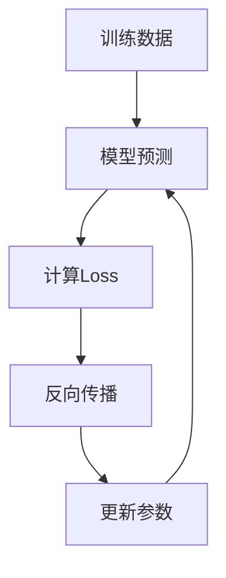

# 04 · Training：能力如何从参数中产生

> 一句话直觉：**训练不是给模型安装知识，而是在错误中不断调整参数，让内部表示越来越适合完成任务。**

---

## 1. 初始模型其实什么都不会

刚初始化的神经网络参数接近随机：

```text
输入：2+2=
输出：香蕉
```

完全正常。

因为它还没有形成任何有效结构。

---

## 2. 一次训练循环发生什么？



例如：

真实答案：

```text
猫
```

模型预测：

```text
狗 0.8
猫 0.1
```

Loss 告诉模型：

```text
这个方向错了。
```

然后调整参数。

---

## 3. 参数到底改变了什么？

不是简单增加一条规则：

```text
看到猫图片 → 输出猫
```

而是改变大量矩阵：

```text
Embedding
Attention 权重
MLP 参数
输出层参数
```

让未来遇到类似模式时，内部计算更容易产生正确结果。

---

## 4. 知识到底存在哪里？

很多人问：

“模型是不是有一个数据库存答案？”

不是。

更接近：

```text
大量参数共同形成一个复杂函数
```

输入经过这个函数：

```text
Token
 ↓
Layer 1
 ↓
Layer 2
 ↓
...
 ↓
概率分布
```

知识不是一个文件，而是分布在整个网络中。

---

## 5. 为什么训练会形成概念？

因为世界中的规律存在重复结构。

例如大量文本中：

```text
太阳
天空
白天
光
```

经常共同出现。

模型为了降低预测误差，会逐渐调整内部表示，使这些模式产生联系。

概念不是人工写入，而是在统计结构中逐渐形成。

---

## 6. 训练和推理的区别

训练：

```text
允许修改参数
```

推理：

```text
参数固定，只计算结果
```

所以聊天时模型不是边聊天边永久学习。

---

## 7. 一个重要观点

LLM 的能力来自三个东西共同作用：

```text
数据
 +
模型结构
 +
计算规模
```

只有数据，没有结构：无法有效学习。

只有结构，没有数据：没有经验。

只有规模，没有训练：只是巨大的随机矩阵。

---

下一章进入多模态之前，需要理解：

> Transformer 为什么能够让不同 Token 互相寻找关系？

这就是 Attention。
