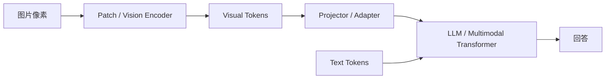
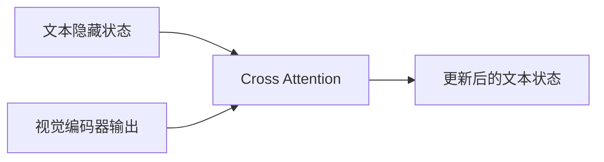
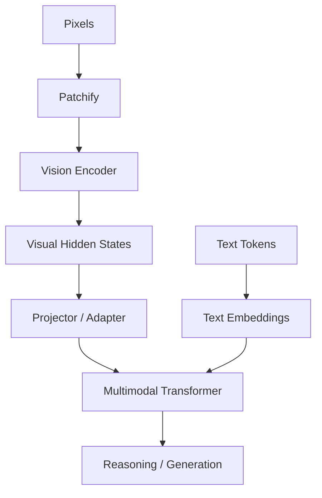

# 05 · 原生多模态：模型到底是怎么“看见”的

> 一句话直觉：**原生多模态不是“没有视觉模块”，而是图片不必先被压缩成一句人类语言，再交给语言模型。它可以以高维视觉状态直接参与后续推理。**

这一章专门解决一个最容易混淆的问题：

> 图片最终也要变成 Token，那 Visual Token 不还是“图片被理解后生成的关键词”吗？

答案是：**不是。Visual Token 是向量状态，不是自然语言标签。**

---

## 1. 先把两条路线彻底分开

### 工作流式多模态


例如原图里有：

- 红色杯子；
- 杯口细裂纹；
- 杯身写着 `SALE 50%`；
- 后面有一个模糊人影；
- 杯子位于键盘左侧。

如果视觉模型只总结：

```text
桌上有一个红色杯子。
```

那主 LLM 永远拿不到裂纹、文字、人物和空间关系。

这里真正的问题叫 **语言瓶颈**：视觉信息被迫先压缩成一句话。

### 原生 / 深度融合式多模态



视觉模块仍然存在，但它输出的不是：

```text
“这是一个红色杯子。”
```

而可能是几百、几千个高维向量。

---

## 2. Visual Token 为什么不是一个像素？

直接让每个 RGB 像素成为一个 Token 通常太昂贵，而且单个像素的语义太弱。

Vision Transformer 常见做法是先切 Patch。

假设图片尺寸：

```text
224 × 224 × 3
```

Patch 大小：

```text
16 × 16
```

那么一边有：

```text
224 / 16 = 14
```

总共：

```text
14 × 14 = 196 patches
```

每个 Patch 包含：

```text
16 × 16 × 3 = 768
```

个原始数值。

然后用一个可学习线性映射，把这 768 个数投影成一个 `d` 维向量：

```text
Patch pixels
    ↓
Linear Projection
    ↓
Visual Embedding
```

所以最开始的 Visual Token 更接近：

> **一小块图像的可学习数值表示。**

而不是“猫”“杯子”“裂纹”这种词。

---

## 3. 那么语义什么时候出现？

不是某一步突然执行：

```python
label = recognize(patch)
```

更像多层连续变化：

```text
像素差异
 ↓
边缘 / 亮度 / 色彩结构
 ↓
纹理和局部形状
 ↓
物体部件
 ↓
对象结构
 ↓
对象之间的关系
 ↓
任务相关语义
```

注意，这个流程只是帮助理解层级抽象，不意味着每一层都有人工可读、严格固定的职责。

真实深度网络里的表示通常是分布式的。

---

## 4. “我得先理解，才能找到；我得先找到，才能理解”的矛盾

这是多模态里最值得弄明白的问题。

假设用户问：

```text
杯口有没有裂纹？
```

错误直觉是：

```text
先识别每个 Patch 是什么
      ↓
给某个 Patch 标记：裂纹
      ↓
问题出现“裂纹”
      ↓
查找带裂纹标签的 Patch
```

如果真这么做，确实循环了。

实际更像：

```text
问题隐藏状态 → Query
视觉隐藏状态 → Keys / Values
```

然后 Query 与所有视觉 Key 计算匹配：

```text
Q · K1
Q · K2
Q · K3
...
Q · K382
Q · K383
...
```

相关区域自然得到更高权重。

没有任何地方需要提前存在：

```text
K382.label = "裂纹"
```

### 为什么 Q 和正确区域能匹配？

因为训练。

训练阶段不断出现类似：

```text
图片 + 问题 + 正确答案
```

回答错误产生 Loss，梯度会改变：

```text
Vision Encoder
Projector
Attention
LLM 参数
```

最终形成：

> 某些“裂纹相关语言状态”和“裂纹相关视觉状态”更容易在可学习空间里发生有效交互。

因此 **Attention 本身就是理解过程的一部分，不是理解完成后的检索工具。**

---

## 5. Projector 到底在“翻译”什么？

假设视觉编码器输出：

```text
1024 维
```

而 LLM hidden size 是：

```text
4096 维
```

两边接口不一致。

可以增加 Projector：

```text
1024D Visual Feature
      ↓
Linear / MLP / Adapter
      ↓
4096D LLM-compatible Feature
```

它不是：

```text
图片 → 中文句子
```

而是：

```text
一种向量坐标系 → 另一种可联合计算的向量坐标系
```

所以把 Projector 理解成“翻译器”可以，但它翻译的是 **表示空间**，不是自然语言。

---

## 6. CLIP 为什么经常出现在多模态讨论里？

理解多模态对齐，可以先理解 CLIP 的核心思想。

训练数据里有很多图片和文字配对：

```text
[猫图片] ↔ “a cat sleeping on a sofa”
[汽车图片] ↔ “a red sports car”
```

分别编码：

```text
Image Encoder → image embedding
Text Encoder  → text embedding
```

训练目标希望：

```text
正确图文对 → 相似度高
错误图文对 → 相似度低
```

极简示意：

```text
                 文本
              猫    汽车   海滩
图片  猫      高     低     低
     汽车     低     高     低
     海滩     低     低     高
```

这叫 **对比学习（contrastive learning）** 的一种典型思路。

重要的不是 CLIP 本身，而是它展示了：

> **不同模态可以在训练中学会可比较、可对齐的表示，而不必先互相翻译成语言。**

---

## 7. “共享语义空间”不要理解得太字面

经常会看到一句话：

```text
猫的文字、猫的图片、猫叫声，都进入同一个语义空间。
```

这句话作为直觉很好，但不要想成模型内部真的存在一个三维地图：

```text
x=动物
y=毛茸茸
z=猫
```

真实表示是高维、分布式、随层和上下文变化的。

更准确地说：

> 训练让不同模态的表示建立足以支持任务的对应关系和可交互结构。

不一定存在一个简单、静态、完美统一的“世界坐标系”。

---

## 8. 三种常见多模态融合方式

不同模型实现差异很大，但可以先分成三种教学上的思路。

### A. 视觉 Token 直接拼进序列

```text
<image>
V1 V2 V3 ... Vn
</image>
用户：图里有什么？
```

视觉表示投影到兼容维度后，与文本一起进入 Transformer。

### B. Cross-Attention



文本通过 Cross-Attention 按需读取视觉特征。

### C. 更统一的多模态 Transformer

不同模态经过各自输入处理后，更早进入统一主干共同计算。

所谓“原生多模态”在产品宣传和论文里并没有绝对统一的技术定义，所以判断架构时最好看：

- 模态在哪里进入模型；
- 是否联合训练；
- 中间是否经过自然语言瓶颈；
- 主干参数共享到什么程度。

---

## 9. 为什么视觉 Token 数量也很重要？

图片信息量很大。

如果切得越细：

```text
Patch 越小
→ Visual Tokens 越多
→ 小文字、小物体、细节更容易保留
→ 计算成本也更高
```

如果压缩得太狠：

```text
几千个视觉状态
 ↓ 压缩
几十个状态
```

计算便宜，但细节可能丢失。

所以多模态工程一直存在一个核心权衡：

> **视觉信息带宽 vs 上下文和算力成本。**

这和工作流 Caption 的区别不是“原生模型完全不压缩信息”，而是原生模型通常保留了比一句自然语言 Caption 更丰富、更可针对问题动态读取的中间表示。

---

## 10. 为什么 OCR 有时仍然单独存在？

原生多模态不意味着：

```text
以后 OCR、目标检测、专用视觉模型全部没用了
```

如果任务需要：

- 精确读取票据字段；
- 大批量扫描文档；
- 像素级定位；
- 工业缺陷检测；
- 非常稳定的结构化抽取；

专用模型可能仍然更便宜、更稳定、更容易评估。

所以工程系统里经常出现：

```text
原生多模态模型
+
OCR
+
检测模型
+
工具调用
```

这不是“退化成伪多模态”，而是任务工程。

---

## 11. 音频和视频也是同一个核心逻辑

### 音频

```text
波形
 ↓
时间窗口 / 声学特征编码
 ↓
Audio Tokens / Features
 ↓
联合模型
```

### 视频

视频比图片多了时间维度：

```text
Frame 1 patches
Frame 2 patches
Frame 3 patches
...
```

于是模型不仅要处理空间关系，还要处理时间关系。

核心仍然是：

> **把不同原始信号变成可学习的连续表示，再让任务损失塑造这些表示之间的关系。**

---

## 12. 工作流多模态和原生多模态，到底谁更好？

不是永远原生更好。

### 工作流方案优点

- 模块简单；
- 容易替换；
- 可解释；
- 可以用便宜专用模型先过滤；
- 工程成本可控。

### 原生方案优点

- 避免早期语言压缩造成的信息损失；
- 可以根据问题动态关注不同视觉区域；
- 跨模态联合推理更自然；
- 更容易处理文字难以完整描述的细节和关系。

真实产品里，两种方法经常混合。

---

## 13. 一个更准确的人类比喻

工作流式多模态：

> 一个看得见的人看完图片，用几句话描述给另一个看不见的人。

原生多模态：

> 视网膜和视觉系统把高带宽神经信号送进同一个认知系统。

注意：眼睛和大脑仍然是不同模块。

所以区别不是：

```text
有没有模块边界
```

而是：

```text
模块之间是不是必须经过自然语言这个强压缩接口
```

---

## 14. 本章脑内模型



不要再想：

```text
图片 → 关键词 → LLM
```

更准确的是：

```text
图片 → 连续视觉状态 → 跨模态交互 → 输出语言
```

---

## 15. 这一章只需要带走七句话

1. **Visual Token 是向量状态，不是自然语言关键词。**
2. **Patch 只是初始分块，语义来自后续多层表示学习。**
3. **Attention 不需要提前给视觉区域打语义标签。**
4. **训练让视觉状态与语言状态建立可用的跨模态关系。**
5. **Projector 对齐的是表示维度和空间，不是在写 Caption。**
6. **“原生多模态”不等于没有 Vision Encoder。**
7. **真正的分界是信息是否被迫先经过自然语言这个有损瓶颈。**

下一章我们从“模型内部参数”走到“模型外部信息”：

> **Context、RAG、长期记忆和模型参数里的知识，到底是四种什么东西？**
