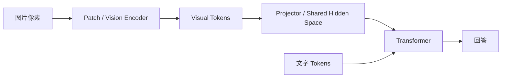
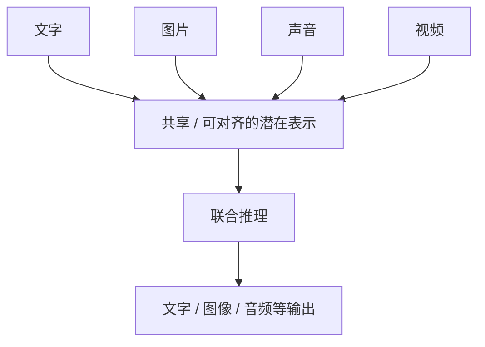

# 05 · 原生多模态：图片为什么不必先翻译成文字

如果只记一句话：

> **原生多模态的关键，不是“没有视觉模块”，而是视觉信息不需要先被压缩成一句自然语言描述，才交给主模型。**

## 两条路线

### 工作流式多模态


例如图片里真实存在：

- 红色杯子
- 杯口细裂纹
- 杯身文字
- 后景人物
- 光照和空间关系

Caption 模型最后只输出：

```text
桌上有一个红色杯子。
```

那么没有写进这句话的信息就已经丢失了。

### 原生多模态

更接近：



这里中间传递的是高维视觉表示，而不是必须可读的人类语言。

## Visual Token 不是“图片对应的一个词”

假设一张图被切成很多小块：

```text
P1  P2  P3  P4
P5  P6  P7  P8
P9 P10 P11 P12
```

每个 Patch 最初只是像素数值。经过线性投影或视觉编码器后，它会变成高维向量：

```text
V1 = [ 0.18, -0.44,  1.02, ... ]
V2 = [-0.73,  0.21,  0.06, ... ]
...
```

这些向量不是：

```text
V1 = “桌子”
V2 = “杯子”
V3 = “裂纹”
```

它们只是神经网络内部状态。

随着层数加深，这些状态逐渐吸收：

```text
颜色
↓
边缘
↓
纹理
↓
局部结构
↓
物体部件
↓
对象关系
↓
更高级语义
```

## 一个常见的“循环矛盾”

很多人会问：

> 如果模型还不知道哪个 Patch 是裂纹，它怎么知道应该 Attention 到那个 Patch？

这个问题的答案来自上一章：**Attention 不需要先给 Patch 打上“裂纹”标签。**

它只需要让问题产生的 Query，与所有视觉 Key 同时计算相关性。

```text
Q("杯口有没有裂纹？")
       │
       ├── 与 K1 算相似度
       ├── 与 K2 算相似度
       ├── 与 K3 算相似度
       ├── ...
       ├── 与 K382 算相似度
       └── 与 K383 算相似度
```

训练会逐渐让“裂纹相关语言模式”和“裂纹相关视觉模式”在可学习的表示空间里产生更高匹配。

所以不是：

```text
先理解 → 打标签 → 再找到
```

而是：

```text
初级视觉表示
↓
多层表示变换
↓
问题相关 Attention
↓
进一步形成语义状态
↓
输出答案
```

“寻找”和“理解”是共同发生的。

## 为什么还需要 Vision Encoder？

因为直接把每个 RGB 像素都当成一个普通语言 Token，计算和结构都不合适。

视觉编码器负责先把原始像素变成更适合 Transformer 消化的视觉表示。

例如：

```text
16 × 16 × 3 个像素值
        ↓
线性投影 / Vision Transformer
        ↓
一个 d 维视觉向量
```

从接口上看，确实还是：

```text
视觉模块 → 主模型
```

所以“原生”绝不意味着内部没有模块。

真正重要的是模块间传递的是：

```text
高带宽、可学习、非语言化的视觉状态
```

而不是：

```text
一段已经总结好的 Caption
```

## Projector 在做什么？

假设视觉编码器输出 1024 维，但语言模型隐藏层使用 4096 维。

两者不能直接拼接，于是中间可能有一个 Projector：

```text
1024 维视觉表示
      ↓
MLP / Linear Projection
      ↓
4096 维隐藏表示
```

它的作用不是“翻译成中文”，而是把不同模态映射到可以参与后续联合计算的表示空间。

## 原生多模态真正追求什么？

最终目标不是：

```text
所有东西 → 文字 → LLM
```

而更像：



因此，“猫”可以同时由：

- `猫` 这个文字
- 一张猫的图片
- 一段猫叫
- 一段猫走路的视频

指向某些可对齐的概念结构。

## 工作流和原生多模态的真正区别

那个常见比喻可以改写成：

### 工作流式

> 一个人看完图片，先用语言总结，再讲给另一个人。

### 原生多模态

> 眼睛把视觉神经信号直接送进自己的认知系统。

眼睛和大脑当然仍然是不同模块。

差别不在于有没有模块，而在于：

> **中间接口是不是自然语言这个有损瓶颈。**

## 本章结论

```text
伪 / 工作流多模态：
图片 → 文字描述 → LLM → 回答

原生多模态：
图片 → 高维视觉表示 → 联合 Transformer / 跨模态交互 → 回答
```

视觉 Token 不是“图片转换成的关键词”。

它更接近一种中间神经状态，而文字只是众多模态中的一种输入形式。
