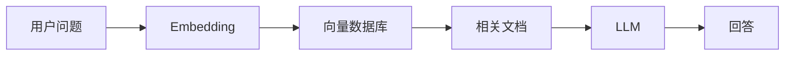
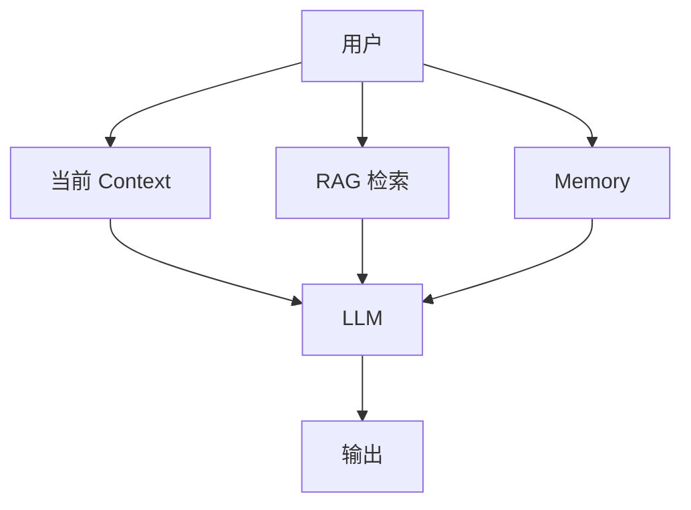

# 06 · Context、RAG 与长期记忆：模型不知道的东西怎么办？

> 一句话直觉：**模型参数保存的是训练中形成的能力；Context 是当前临时输入；RAG 是外部检索；Memory 是系统主动保存的长期信息。四者不要混为一谈。**

很多人说：

> “给 AI 加记忆。”

但这里至少包含四种完全不同的问题。

---

## 1. 模型参数里的知识

例如：

```text
法国首都是巴黎
```

可能已经通过训练形成在模型参数中。

特点：

- 不需要额外数据库；
- 推理速度快；
- 但修改困难；
- 不保证永远准确。

它更像：

> 大脑长期形成的知识结构。

---

## 2. Context Window：当前工作区

聊天时发送：

```text
这是我的代码
这是错误日志
这是需求
```

这些内容进入当前上下文。

模型此时可以使用它们。

但是：

```text
对话结束
 ↓
Context 消失
```

它更像：

> 你现在桌面上摊开的文件。

---

## 3. RAG：需要时去查资料

Retrieval-Augmented Generation：



核心思想：

不要强迫模型记住所有资料。

需要时：

```text
问题
 ↓
检索相关内容
 ↓
放入 Context
 ↓
生成答案
```

---

## 4. 为什么 RAG 不等于重新训练？

训练：

```text
改变模型参数
```

RAG：

```text
不改变模型
只是提供额外输入
```

所以更新公司知识库时：

传统训练：

```text
重新收集数据
重新训练模型
```

RAG：

```text
更新文档
重新建立索引
```

成本完全不同。

---

## 5. Embedding 检索为什么有效？

传统搜索：

```text
关键词匹配
```

例如：

搜索：

```text
汽车维修
```

可能找不到：

```text
车辆保养手册
```

因为文字不同。

Embedding 搜索关注的是：

```text
语义距离
```

也就是：

```text
问题向量
       ↕
文档向量
```

是否接近。

---

## 6. 为什么 RAG 也会失败？

因为 RAG 不是魔法。

失败可能来自：

### 检索失败

找到错误文档。

### 切片失败

重要信息被拆散。

### Context 失败

相关内容太长，模型无法有效利用。

### 生成失败

模型仍然可能误解提供的信息。

所以优秀 RAG 系统通常需要：

- 文档清洗；
- Chunk 策略；
- Metadata；
- Reranker；
- Prompt 设计；
- 评估体系。

---

## 7. Memory：Agent 的长期状态

Memory 和 RAG 很像，但目的不同。

RAG：

```text
我需要什么资料？
```

Memory：

```text
关于这个用户，我应该知道什么？
```

例如：

```text
用户喜欢简洁回答
用户正在开发一个 AI 项目
用户之前选择了某个架构
```

这些属于长期交互状态。

---

## 8. 一个完整 AI 系统通常是什么样？



模型本身只是其中一个组件。

现代 AI 产品越来越像：

```text
LLM
+
数据库
+
检索系统
+
工具
+
状态管理
```

---

## 9. 和人的记忆类比

| AI | 人类类似物 |
|---|---|
| 参数 | 长期知识 |
| Context | 当前工作记忆 |
| RAG | 查书、搜索资料 |
| Memory | 记住朋友习惯 |

这个类比不是严格等价，但能帮助建立边界。

---

## 本章结论

```text
参数 = 模型学会的能力
Context = 当前输入
RAG = 外部知识查询
Memory = 系统保存的长期状态
```

不要试图让一个模型同时承担数据库、搜索引擎和用户档案系统的全部职责。

好的 AI 系统通常是多个组件协作。

下一章进入 Agent：

> 当 LLM 可以调用工具、规划步骤、修改环境，它和普通聊天模型到底差在哪里？
