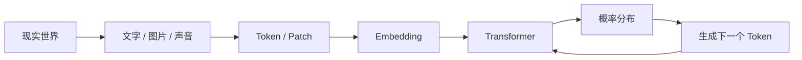

# Hello LLM

> 用图解、直觉与最小代码，从零理解大语言模型。

很多人第一次接触 LLM，会同时听到 Token、Embedding、Transformer、Attention、Loss、RAG、Agent、多模态……这些词分别都能查到解释，但真正困难的是：**它们之间到底是怎么连起来的？**

这本小书不要求你先会线性代数，也不要求先啃论文。我们先建立一条完整的信息流：

## 我们真正想回答的问题

不是“Attention 的公式是什么”这么简单，而是：

- 为什么把文字变成向量之后，模型还能保留含义？
- 为什么预测下一个 Token 能产生看起来像推理的行为？
- Attention 为什么不需要先知道哪里重要，就能找到重要区域？
- 训练到底把什么东西“写进”了模型参数？
- 图片进入模型时，为什么不必先翻译成一句文字？
- RAG、上下文、长期记忆和模型参数中的知识有什么本质区别？

## 推荐阅读顺序

第一次读时建议按左侧目录顺序前进。每一章都尽量遵循同一套结构：

1. **先给直觉**：能先用自己的话讲明白。
2. **再看信息流**：知道数据到底经过了哪里。
3. **再对应术语**：把直觉映射到真实模型结构。
4. **最后跑实验**：用最小代码看看数学过程实际发生了什么。

!!! note "这不是模型训练教程"
    这里的第一目标不是教你训练一个百亿参数模型，而是让你看到任何新架构时，都能迅速判断它把信息放在哪里、让哪些表示彼此交互、以及训练信号如何塑造这些表示。

从下一章开始，我们先把整台机器拆成几个最重要的零件。
